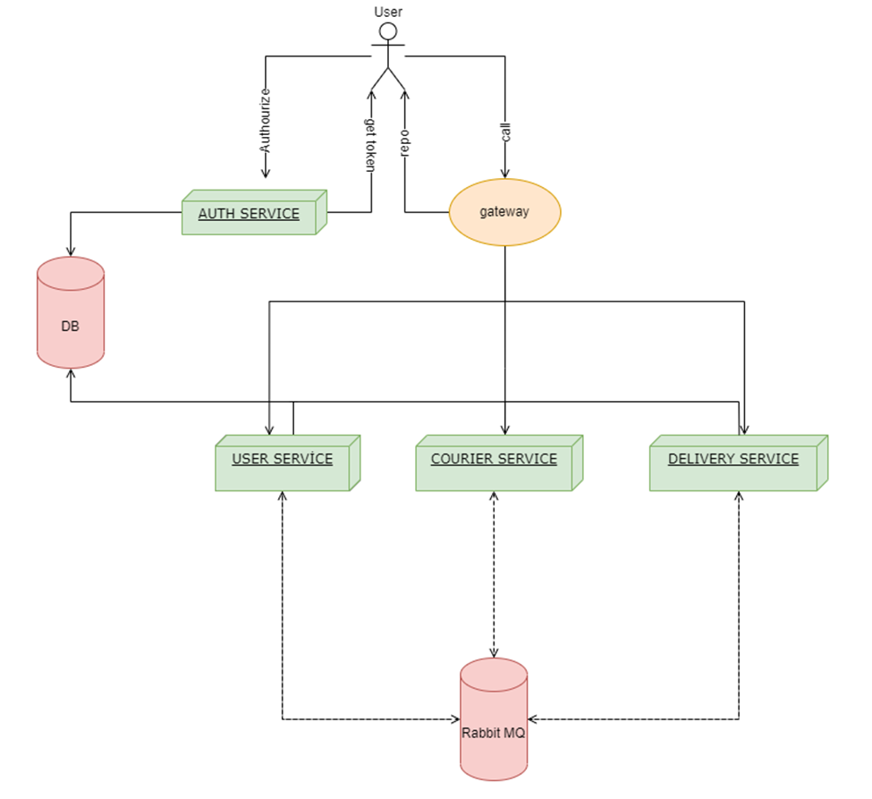

# Guavapay Test Case

In the test case, I used Java11, Gradle, new Spring-Authorization-Server, Spring Cloud Stream, QueryDSL etc.  
Swagger presented in project and grouped by microservices. But, at the same time I prepared postman collection because it is more usual in my opinion.
This test case consists of 3 microservices, auth-service , gateway, postgesdb and rabbitmq message broker.
For distributed transactions, I used event sourcing and saga pattern. 

I prepared a shell script file for installation named "deploy.sh" .
After that, I prepare postman collection for calling endpoints. 
filename : Guavapay.postman_collection.json

Default oauth2 client id is "api-client" and secret is "secret"
Default admin username is "yasarmatrac" and password is "123456"
Payload and endpoints is located in the postman collection.
Register User endpoint is permitted all.
As a ADMIN  “Create Courier”, this is an endpoint for creating new courier.
As a USER  Create Delivery is an endpoint for creating new delivery.
As any user role Get Deliveries is an endpoint for listing all deliveries that the system has and related user.
As a ADMIN, Get Couriers is an endpoint for listing all couriers that the system has.
As a COURIER DMIN, The start transport endpoint ensures to start transportation only for the user which is a courier.
As a COURIER, The Add Track endpoint ensures to add the location info of the delivery.
As a COURIER or ADMIN, The Get Track endpoint ensures to be listed location info of the delivery.
As a COURIER, Complete Transportation is an endpoint for completing the transportation.
